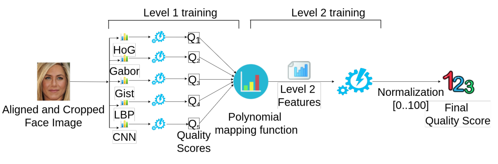
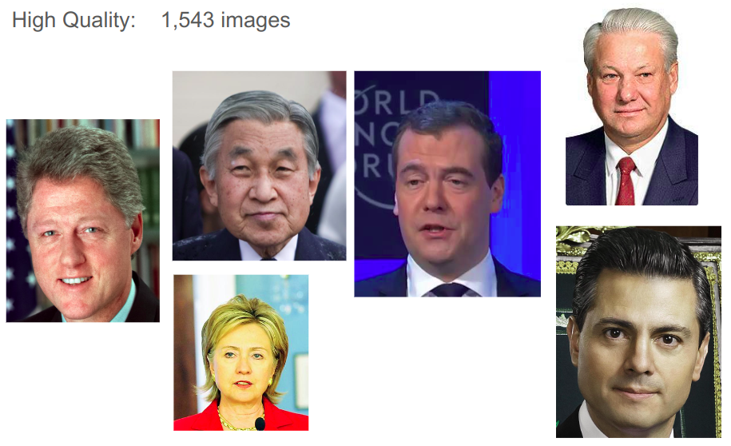
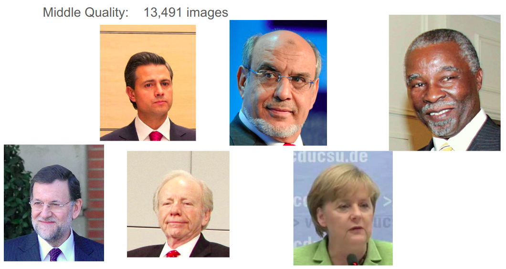
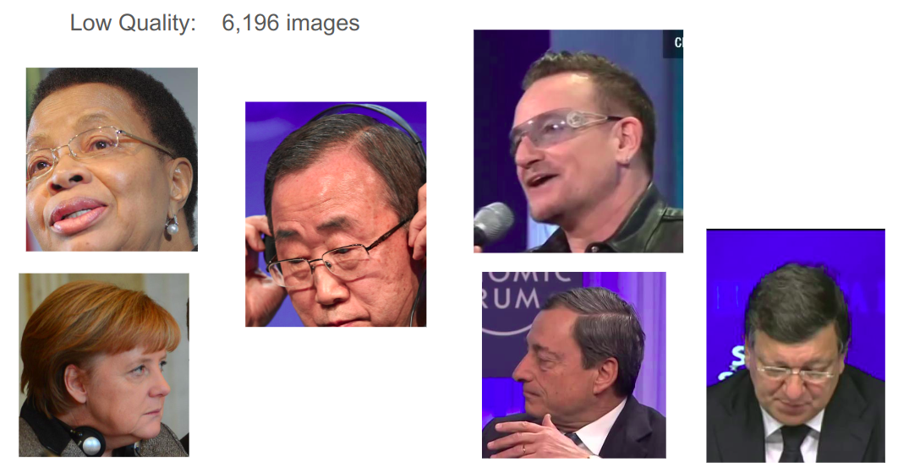

# Face Image Quality Enhancement Study for Face Recognition
This repository contains code, materials for the work of face enhancement on face recognition task.

[[Report]](xxx)

# Abstract
* The problem of face recognition in low quality photos has not been well-studied so far. 
* We try to explore the face recognition performance on low quality photos
* Try to improve the accuracy in dealing with low quality face images
* Assemble a large database with low quality photos
* Examine the performance of face recognition algorithms for three different quality sets
* Using state-of-the-art facial image enhancement approaches, we explore the face recognition performance for the enhanced face images.
  
# Database
* Real world images can simultaneously have multiple quality attributes, e.g, having pose variation, low illumination and a large expression variation at the same image, which makes the problem very hard. 
* We use a database of unconstrained face images and performed cross quality face recognition.
  
## IJB-A dataset:
  * contains 500 celebrities of the world.
  * 21,230 images in total
  * Focus on studying the affect of face image quality enhancement for improved face recognition with different image qualities.

# Face Quality Score Assessment
* A learning of rank based quality assessment approach is used. 
* The face image quality framework uses two level training process to train a RankSVM. 
* First, five different face recognition features are extracted: HoG, Gabor, Gist, LBP and CNN.
* Then, construct new features from the output of the first level prediction using a 5th degree polynomial kernel mapping function. 
* The result of the second level prediction is normalized and rounded off and considered as the quality score.

# Different quality levels
Divide the database into three different quality sets.

* High Quality:
score of each image >= 60

* Middle Quality:    
score of each image between [30,60)

*Low Quality:    
score of each image < 30

# Enhancement methods
* There are various causes that can affect the quality of a face images, such as:
      pose variation
      uneven or too high or too low illumination
      image resolution
      occlusion
      motion blur etc.
* We tried to enhance the quality of the low and middle quality image sets by applying different image quality enhancement methods. 
* For our study, we focused on three enhancement methods:
  
    1) pose correction,
       
    2) correcting motion blur
       
    3) normalizing illumination variation.

